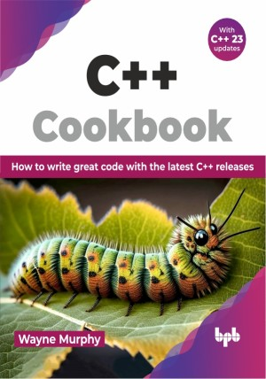

# C++ Cookbook

Getting up to speed with the latest C++ features

This is the repository for [C++ Cookbook
](https://bpbonline.com/products/c-cookbook?variant=43494538084552),published by BPB Publications.

## About the Book
C++ continues to remain relevant despite the advent of many new modern languages. This book dives into the significant features of C++20 ("big four") and C++23, addressing challenges and improving development. You will learn how to write cleaner, more efficient, and safer code. From organizing your projects better to handling complex tasks easily, this guide equips you to take your C++ skills to the next level.

We start by discussing basic concepts and learning how to use them in templates. Then, we explore advanced topics like asynchronous programming with coroutines and tools for handling multiple tasks at once. You will discover C++ modules for building modular applications to organize code better. You will learn about ranges for processing data sequences efficiently, including views and adaptors for transforming and filtering data. Further, you will explore new features for containers, cleaner coding practices, and performance optimizations in C++20/23.

The most challenging yet intriguing part about C++ is that it has evolved over the decades. Due to these changes, you will often find different ways of doing the same thing. The book describes the latest features in detail. It shows how you can do your job in the best manner, by implementing these features in the latest, fastest, cleanest, and safest way.

## What You Will Learn
• Coroutines to create code that handles asynchronous tasks seamlessly.

• Process sequences of data efficiently using ranges and range-based for loops.

• Utilize improvements and new functionalities for existing containers like vector, list, map, and set.

• New features like improved range adaptors, functional programming constructs, and lambda enhancements.

• User-defined literals, filesystem library enhancements, and type safety features offered by concepts.

